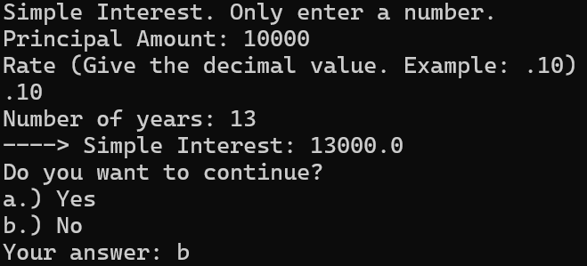
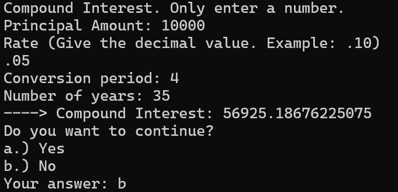

# Mathematics of Finance

This repository is for financing using python programming language. It have Compound Interest and Simple Interest. What it do is, it will ask us what are the given value then
it will give the answer.

Examples:
2. Simple Interest
  - 

1. Compound Interest
  - 

Quick start (Use python IDE):
1. git clone https://github.com/clediscover/Mathematics-of-Finance.git
2. cd Mathematics-of-Finance
3. python3 'Compound Interest.py'
4. python3 'Simple Interest.py'